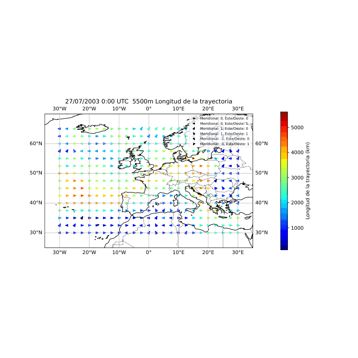

# TFG - Grado en Física (Universidad de Alicante)

- En este repositorio se presentan los resultados del trabajo de fin de grado titulado: "Un método lagrangiano para la identificación de situaciones de bloqueo atmosférico". Los archivos se nombrarán de manera numérica para asegurar una mayor claridad. En el trabajo, se especificará el número de archivo correspondiente a cada referencia.

 ### Aclaración
- - En las siguientes animaciones, parece que la escala de colores empleada no es global, es decir, que cambia en cada frame. Sin embargo, la escala de colores se ha aplicado de manera global para todos los instantes. La percepción de cambio en la escala se debe únicamente a la transformación de los frames a formato GIF.

  ## (1) Mapa distancias End-to-End animado
  

  ## (2) Mapa distancias trayectorias animado
  
