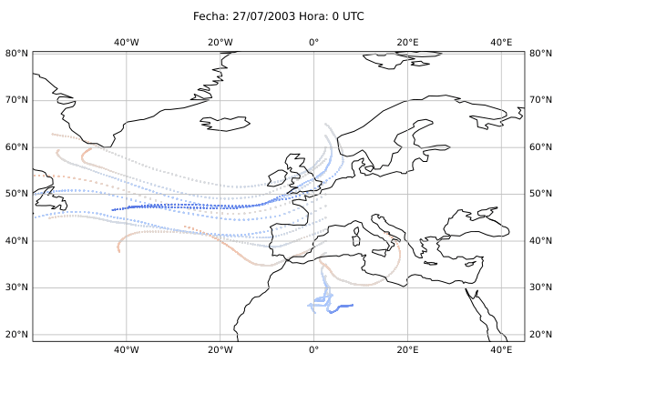

# TFG - Bachelor's Degree in Physics (University of Alicante)

- In this repository, the results of the final degree project titled "A Lagrangian Method for the Identification of Atmospheric Blocking Situations" are presented. The files will be named numerically to ensure greater clarity. In the project document, the corresponding file number will be specified for each reference.

  ## Figure 14
 

 
  
  
