<div align="center">

# Un método lagrangiano para la identificación de situaciones de bloqueo atmosférico

**Trabajo de Fin de Grado (TFG) · Grado en Física · Universidad de Alicante**

*Identificar bloqueos atmosféricos a partir del análisis masivo de retro-trayectorias de partículas de aire, en lugar de los campos termodinámicos clásicos.*

[](#)
[](#)
[](#)
[](#)
[](#)
[](../LICENSE)

**🌐 Idioma:** [English](../README.md) · **Español** · [Català](README.ca.md)

<br>

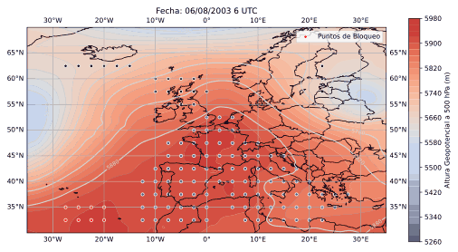

<sub><i>Región de bloqueo detectada (cluster rojo) evolucionando sobre el sector euro-atlántico, aislada con DBSCAN sobre el campo de altura geopotencial a 500 hPa — ola de calor de agosto de 2003.</i></sub>

</div>

---

## 📑 Índice

- [Resumen](#-resumen)
- [Por qué es importante](#-por-qué-es-importante)
- [La idea en una imagen](#-la-idea-en-una-imagen)
- [Metodología](#-metodología)
- [Resultados](#-resultados)
- [Competencias y stack técnico](#-competencias-y-stack-técnico)
- [Estructura del repositorio](#-estructura-del-repositorio)
- [Leer la memoria completa](#-leer-la-memoria-completa)
- [Cómo citar](#-cómo-citar)
- [Autor](#-autor)
- [Licencia](#-licencia)

---

## 📄 Resumen

Los bloqueos atmosféricos son patrones de presión cuasi-estacionarios de gran escala que
interrumpen el avance normal de oeste a este de los sistemas meteorológicos. Pueden provocar
**olas de calor en verano** y **olas de frío en invierno**, con impactos bien documentados sobre
la salud pública, la agricultura, la disponibilidad de agua y el riesgo de incendios. En un clima
cambiante, la frecuencia de estos fenómenos extremos ha aumentado, lo que hace cada vez más
relevante su identificación y caracterización precisas.

Tradicionalmente, los bloqueos se han detectado mediante diagnósticos **eulerianos** basados en
campos termodinámicos (por ejemplo, anomalías de altura geopotencial o gradientes meridionales).
Este trabajo propone una **alternativa lagrangiana innovadora**: en lugar de mirar los campos,
analiza el *movimiento* del propio aire. Usando el modelo **HYSPLIT** alimentado con datos de
reanálisis **ERA5**, se calculan millones de **retro-trayectorias** de partículas virtuales, y las
regiones donde esas trayectorias *se estancan* se señalan como zonas candidatas a bloqueo. Esto
proporciona una identificación explícita y geográficamente localizada de los bloqueos, junto con su
**localización, extensión, duración e intensidad** y su **evolución temporal**.

> *"Comprender y predecir el bloqueo atmosférico sigue siendo uno de los grandes retos de la
> meteorología."* — Michael E. Mann

**Palabras clave:** bloqueos atmosféricos · método lagrangiano · retro-trayectorias · HYSPLIT · ERA5 · DBSCAN · cambio climático

---

## 🌍 Por qué es importante

| Impacto | Consecuencia de un bloqueo persistente |
| --- | --- |
| 🔥 Olas de calor | Exceso de mortalidad, sobre todo en regiones no preparadas para el calor extremo |
| ❄️ Olas de frío | Condiciones de heladas prolongadas en invierno |
| 🌵 Sequías | Presión sobre la agricultura, el suministro de agua y los ecosistemas |
| 🌲 Incendios | Mayor riesgo de incendios por condiciones secas y estancadas |
| ⚡ Energía | Picos de demanda (refrigeración/calefacción) y más emisiones |

Mejores métodos de detección alimentan directamente la **predicción a largo plazo** y la
**gestión del riesgo climático** — justo lo que este enfoque lagrangiano busca mejorar.

---

## 💡 La idea en una imagen

Un bloqueo es, físicamente, una región donde la atmósfera **deja de fluir**. Si liberamos
partículas virtuales e integramos sus trayectorias *hacia atrás* en el tiempo, las partículas
dentro de un bloqueo apenas se desplazan: su **distancia end-to-end** y la **longitud de la
trayectoria** se desploman frente al flujo zonal rápido del *jet stream* circundante.

<div align="center">
<table>
<tr>
<td align="center"><b>Distancia end-to-end</b><br><sub>Cuán lejos acaba cada partícula de su origen</sub><br>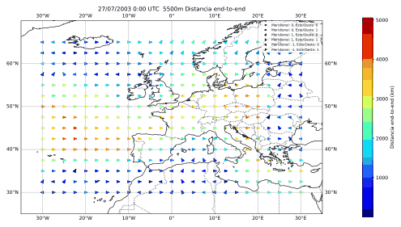</td>
<td align="center"><b>Longitud de la trayectoria</b><br><sub>Longitud de arco total recorrida por cada partícula</sub><br>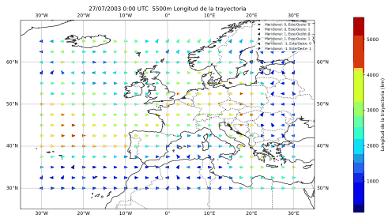</td>
</tr>
</table>
<sub><i>Colores fríos = trayectorias cortas y estancadas → candidato a bloqueo. Colores cálidos = trayectorias largas y móviles → flujo zonal sin bloqueo. Sector euro-atlántico, verano de 2003.</i></sub>
</div>

---

## 🔬 Metodología

El flujo de trabajo transforma un conjunto bruto de trayectorias de HYSPLIT en una región de
bloqueo delimitada y con evolución temporal:

```
Reanálisis ERA5 ─▶ retro-trayectorias HYSPLIT ─▶ métricas por partícula ─▶ filtrado temporal ─▶ clustering DBSCAN ─▶ región de bloqueo
```

1. **Datos y dominio.** Reanálisis ERA5 sobre el sector euro-atlántico, analizado en el nivel de
   **500 hPa** — la superficie de referencia para la dinámica de bloqueo en la troposfera media.
2. **Métricas de trayectoria.** Para cada retro-trayectoria se calculan tres descriptores
   lagrangianos:
   - **Distancia end-to-end** y **longitud de la trayectoria**, con la fórmula de **Haversine** sobre la esfera.
   - **Proyección zonal** y **meridional** (extensión este–oeste / norte–sur de cada trayectoria).
3. **Reducción estadística.** Se siguen la media, la mediana y la desviación estándar de cada
   métrica, tanto en el espacio (perfiles en latitud/longitud) como en el **tiempo** (evolución
   temporal global).
4. **Filtro de bloqueo.** Un umbral basado en percentiles y adaptativo a la intensidad señala los
   puntos de malla cuyas trayectorias son anómalamente cortas → una **matriz de bloqueo** binaria
   por instante.
5. **Delimitación de la región.** Los puntos candidatos se agrupan con **DBSCAN** (clustering
   basado en densidad) para aislar la región de bloqueo coherente y descartar el ruido.

> En los apéndices de la memoria se incluye una introducción a los conceptos de apoyo — viento
> geostrófico y de gradiente, altura geopotencial, el algoritmo DBSCAN y la métrica del taxista.

---

## 📊 Resultados

El método se validó sobre dos episodios de bloqueo europeos bien conocidos: las olas de calor de
**agosto de 2003** y **junio de 2019**. Las animaciones siguientes son las salidas reales del
flujo de trabajo.

### Firma del bloqueo en las métricas de trayectoria

Los perfiles espaciales de la distancia end-to-end revelan una clara depresión sobre la región
bloqueada (banda sombreada = ±1 desviación estándar):

<div align="center">
<table>
<tr>
<td>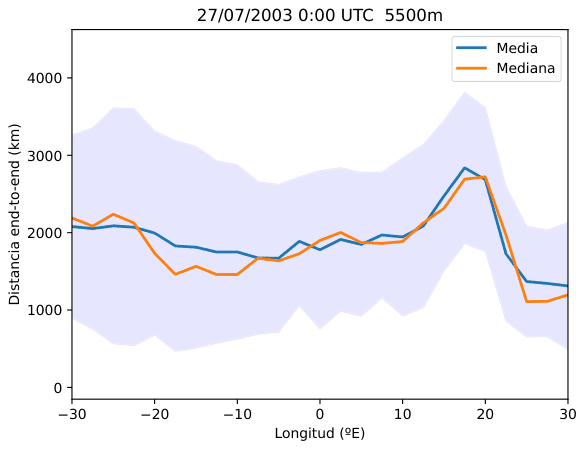</td>
<td>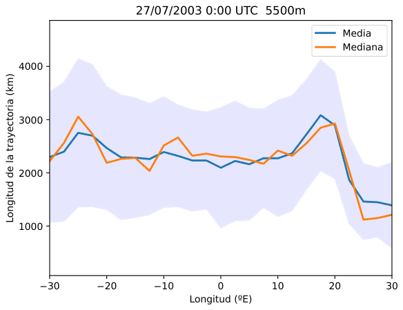</td>
</tr>
<tr>
<td>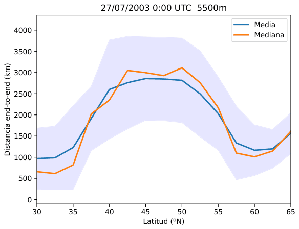</td>
<td>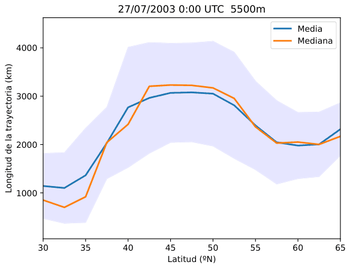</td>
</tr>
</table>
<sub><i>Perfiles de distancia end-to-end (izquierda) y longitud de trayectoria (derecha), vistos en longitudes (arriba) y en latitudes (abajo).</i></sub>
</div>

### Proyecciones zonal y meridional

<div align="center">
<table>
<tr>
<td align="center"><b>Proyección zonal</b><br>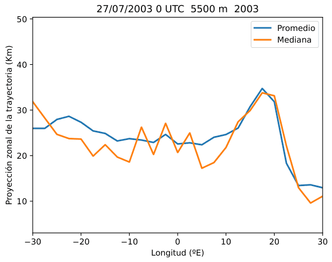</td>
<td align="center"><b>Proyección meridional</b><br>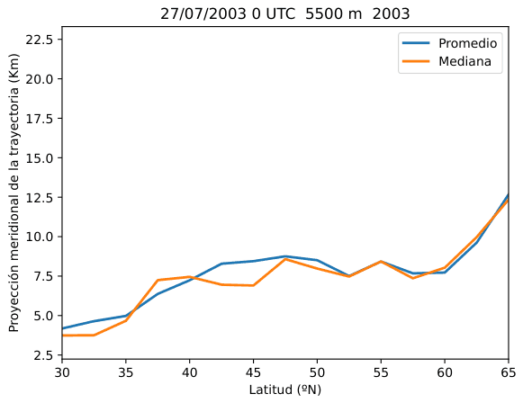</td>
</tr>
</table>
</div>

### Matrices de bloqueo

El paso de filtrado produce una máscara binaria por instante — blanco (`1`) donde se cumple el
criterio de bloqueo, negro (`0`) en el resto:

<div align="center">
<table>
<tr>
<td align="center"><b>Proyección meridional</b><br>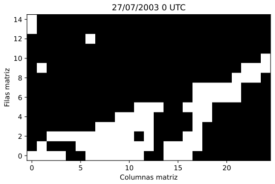</td>
<td align="center"><b>Proyección zonal</b><br>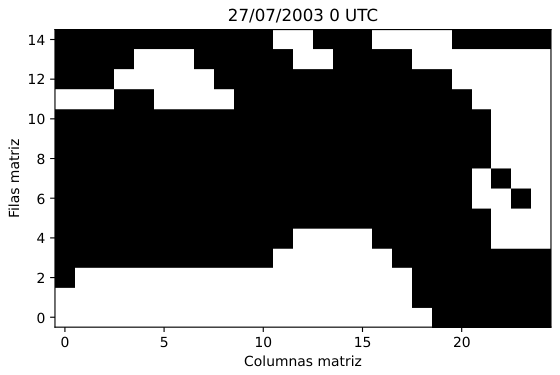</td>
</tr>
</table>
</div>

### Región delimitada final (DBSCAN)

Tras el clustering, la región de bloqueo emerge como un cluster coherente (rojo) sobre el campo de
altura geopotencial a 500 hPa — véase la [animación de la cabecera](#un-método-lagrangiano-para-la-identificación-de-situaciones-de-bloqueo-atmosférico).

**Ideas clave**

- ✅ Un detector puramente **lagrangiano** reproduce episodios de bloqueo conocidos — una mirada
  genuinamente distinta a los diagnósticos eulerianos estándar.
- ✅ La región detectada **se adapta en el tiempo**, lo que permite estudiar el **ciclo de vida**
  (inicio, madurez, declive) de un bloqueo.
- 🔭 Retos abiertos (trabajo futuro): **generalizar** el método más allá de los casos estudiados y
  clasificar automáticamente los bloqueos en tipos **Rex** y **Omega** y sus centros de acción.

---

## 🧰 Competencias y stack técnico

Este proyecto se sitúa en la intersección entre la **física de la atmósfera**, la **computación
científica** y la **ciencia de datos**:

- **Lenguajes y herramientas:** Python, análisis numérico, tratamiento de datos geoespaciales.
- **Modelado:** modelo lagrangiano de trayectorias HYSPLIT; ingesta de reanálisis ERA5.
- **Matemáticas y métodos:** geometría esférica (Haversine), estadística descriptiva, umbrales por
  percentiles, clustering por densidad **DBSCAN**, nociones de topología (métrica del taxista).
- **Dominio:** meteorología sinóptica — viento geostrófico/de gradiente, fuerza de Coriolis,
  altura geopotencial, mapas de isohipsas/isobaras.
- **Comunicación:** figuras reproducibles, visualización científica animada, informe trilingüe.

---

## 🗂 Estructura del repositorio

```
.
├── README.md                  # Versión en inglés (principal)
├── docs/
│   ├── README.es.md           # Estás aquí (Español)
│   └── README.ca.md           # Català
├── thesis/
│   └── TFG_metodo_lagrangiano_bloqueo_atmosferico.pdf   # Memoria completa (75 pp.)
├── figures/
│   ├── *.gif                  # Resultados animados usados en este README
│   └── source/                # Figuras vectoriales originales (PDF)
├── CITATION.cff               # Metadatos de citación legibles por máquina
└── LICENSE                    # CC BY 4.0
```

---

## 📚 Leer la memoria completa

El documento completo (75 páginas, en español) — incluyendo el marco teórico, la derivación
completa del método, la discusión y los apéndices — está disponible aquí:

👉 **[`thesis/TFG_metodo_lagrangiano_bloqueo_atmosferico.pdf`](../thesis/TFG_metodo_lagrangiano_bloqueo_atmosferico.pdf)**

---

## 🔖 Cómo citar

Si haces referencia a este trabajo, cítalo (véase [`CITATION.cff`](../CITATION.cff)):

```bibtex
@thesis{RuizMunoz2024Lagrangian,
  author = {Ruiz Muñoz, Juan Manuel},
  title  = {Un método lagrangiano para la identificación de situaciones de bloqueo atmosférico},
  school = {Universidad de Alicante, Facultad de Ciencias},
  type   = {Trabajo Fin de Grado},
  year   = {2024}
}
```

---

## 👤 Autor

**Juan Manuel Ruiz Muñoz** — Grado en Física, Universidad de Alicante (2023–2024).

[](https://github.com/JuanManuelRM7)

---

## 📜 Licencia

Los contenidos de este repositorio (memoria, figuras y animaciones) se publican bajo la licencia
**[Creative Commons Atribución 4.0 Internacional (CC BY 4.0)](../LICENSE)**. Eres libre de
compartir y adaptar el material para cualquier propósito, siempre que des el crédito adecuado.
